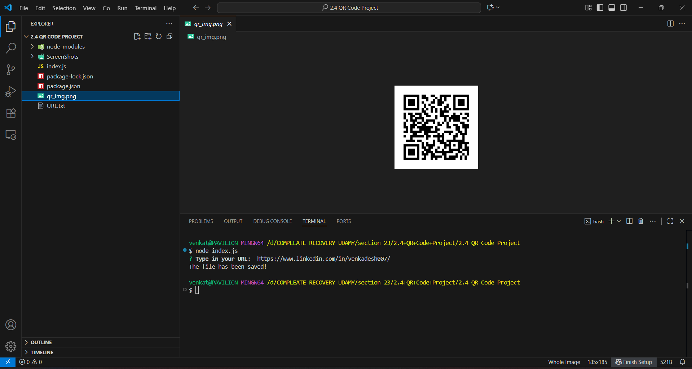
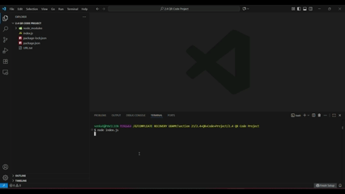

# Project-15-QR-generator-
s=using the qr-image,inquirer packages are used to create it and ,inquireris for get a input. qr-image is for generate the image  and using writeFile from nodejs to save the https://  input





# QR Code Generator

A simple **QR Code Generator** built with **Node.js**.  
This command-line application allows users to generate QR codes from URLs and save them as PNG files.

---

## 🚀 Features
- Interactive CLI prompts using **Inquirer.js**.
- Generates QR codes from any URL using **qr-image**.
- Saves QR codes as PNG files in the project directory.

---

## 🛠️ Technologies Used
- **Node.js** – JavaScript runtime for building the CLI.
- **Inquirer.js** – For interactive command-line prompts.
- **qr-image** – Library to generate QR code images.

---

## 📂 Project Structure

│── index.js # Main application file
│── package.json # Node.js project configuration
│── package-lock.json
│── .gitignore
│── README.md
│── qr-codes/ # Folder where generated QR codes can be saved

## 🎮 How to Use
1. Clone this repository:
   ```bash
   git clone https://github.com/Venkadeshs003/Project-15-QR-generator-.git